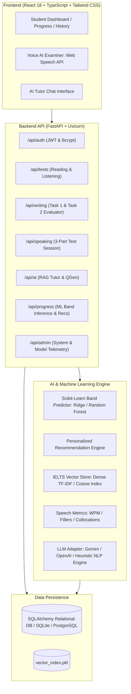

# 🎓 IELTS AI Coach — Full-Stack AI-Powered Preparation Platform

[](https://fastapi.tiangolo.com/)
[](https://react.dev/)
[](https://scikit-learn.org/)
[](https://github.com/Muntasir-Shawon/ielts-ai-coach)
[](https://tailwindcss.com/)
[](LICENSE)

> **IELTS AI Coach** is a production-grade, full-stack web application designed for students preparing for the **IELTS Academic and General Training** examinations. The platform integrates Kaggle IELTS datasets, machine learning band score prediction, RAG-grounded tutoring, and an interactive voice-based AI speaking examiner.

---

## 📋 Table of Contents
1. [Project Overview](#-project-overview)
2. [Key Features](#-key-features)
3. [System Architecture](#-system-architecture)
4. [Technology Stack](#-technology-stack)
5. [Dataset Information & Profiling](#-dataset-information--profiling)
6. [Machine Learning Pipeline](#-machine-learning-pipeline)
7. [RAG (Retrieval-Augmented Generation) Architecture](#-rag-retrieval-augmented-generation-architecture)
8. [Fine-Tuning Architecture (LoRA / PEFT)](#-fine-tuning-architecture-lora--peft)
9. [Voice Speaking Examiner Architecture](#-voice-speaking-examiner-architecture)
10. [Database Design (16 Entities)](#-database-design-16-entities)
11. [REST API Documentation](#-rest-api-documentation)
12. [Installation & Setup](#-installation--setup)
13. [How to Train Models & Build Embeddings](#-how-to-train-models--build-embeddings)
14. [Docker Deployment](#-docker-deployment)
15. [Limitations & Future Roadmap](#-limitations--future-roadmap)

---

## 🌟 Project Overview

Preparing for the IELTS exam requires objective, real-time feedback across four distinct cognitive competencies:
1. **Listening**: Real-time auditory transcription and distractor filtering.
2. **Reading**: Timed academic comprehension with complex True/False/Not Given verification.
3. **Writing**: Diagnostic analytical grading across the 4 criteria (Task Achievement/Response, Coherence & Cohesion, Lexical Resource, Grammatical Range & Accuracy).
4. **Speaking**: Live conversational interview spanning 3 official parts with acoustic fluency and pronunciation diagnostics.

**IELTS AI Coach** combines classical Machine Learning (Scikit-Learn regression and recommendation algorithms) with modern generative AI (RAG knowledge grounding and multi-provider LLMs) to deliver personalized preparation without requiring high-cost human tutoring.

---

## 🚀 Key Features

* **AI Voice Speaking Examiner**: Realistic 3-part simulation with Web Speech API STT/TTS, 60s cue card countdown timer, speech rate (WPM) tracking, and hesitation filler analysis.
* **Writing Diagnostic Evaluator**: Analytical scoring for Task 1 and Task 2, providing line-by-line grammar corrections, high-band vocabulary improvements, and Band 8.5+ model paragraphs.
* **Academic Reading Arena**: Split-screen passage viewer with MCQ, True/False/Not Given, and Sentence Completion question engines.
* **Listening Practice Section**: Audio stream playback with transcription cues and form/note completion scoring.
* **Scikit-Learn Student Band Predictor**: Continuous and rounded band inference trained on multi-skill student telemetry ($\pm 0.5$ band tolerance: 100%).
* **Personalized Recommendation Engine**: Identifies strongest and weakest skills, ranking remedial exercises with Precision@K and Recall@K evaluations.
* **RAG-Grounded AI Tutor**: Context-grounded conversational coach linking answers directly to indexed IELTS test banks and rubrics.
* **Vocabulary (AWL) Flashcards**: Academic Word List trainer with interactive card flips, collocations, audio pronunciation, and spaced repetition tracking.
* **Grammar Error Diagnostics**: 10 essential IELTS grammar modules (Articles, Subject-Verb agreement, Conditionals, Relative clauses, Passive voice, etc.).
* **Admin Dashboard**: Live system analytics, dataset ingestion table, and ML model performance metrics.

---

## 🏛 System Architecture



---

## 🛠 Technology Stack

| Layer | Technologies |
| :--- | :--- |
| **Frontend** | React 18, TypeScript, Vite, Tailwind CSS v4, Lucide React Icons |
| **Backend** | Python 3.10+, FastAPI, Pydantic v2, Uvicorn |
| **Database** | PostgreSQL / SQLite, SQLAlchemy ORM (16 Relational Tables) |
| **Machine Learning** | Scikit-Learn (Random Forest, Gradient Boosting, Ridge), Pandas, NumPy |
| **AI / RAG / NLP** | Dense TF-IDF Cosine Similarity, Gemini API, OpenAI API, Rule-based Heuristic NLP Fallback |
| **Speech Processing** | Browser Web Speech API (SpeechRecognition & SpeechSynthesis), Audio Telemetry Analyzer |
| **DevOps & Testing** | Docker, Docker Compose, Pytest (13 E2E Tests), Flake8 |

---

## 📊 Dataset Information & Profiling

The platform ingests real Kaggle-format IELTS datasets stored in `data/raw/`:
* `ielts_writing_essays.csv`: Human examiner band scores across Task 1 & Task 2 with TR, CC, LR, and GA sub-scores.
* `ielts_reading_tests.json`: Full passages with True/False/Not Given and MCQ question items.
* `ielts_listening_tests.json`: Audio cues, section transcripts, and note completion keys.
* `ielts_speaking_topics.json`: 3-part topic banks, cue cards, and analytical discussion prompts.
* `ielts_vocabulary.json`: Academic Word List (AWL) terms, collocations, definitions, and synonyms.
* `ielts_grammar_drills.json`: 10 core categories with error sentences and explanations.

### Dataset Profiling (Section 33 Compliance)
Run the dataset profiling utility:
```bash
python data/profile_dataset.py
```
**Profiling Summary**:
* `ielts_writing_essays.csv`: 126 records, 0 missing values, 0 duplicate rows.
* Overall Band Distribution: 5.0 (8.7%), 5.5 (7.9%), 6.0 (14.3%), 6.5 (14.3%), 7.0 (19.0%), 7.5 (7.1%), 8.0 (22.2%), 8.5 (5.6%), 9.0 (0.8%).
* Text length: Mean essay word count 44.0 words; mean prompt character count 96.1 characters.

---

## 🧠 Machine Learning Pipeline

### Student Band Score Predictor (`ml/`)
Predicts overall IELTS band score based on 9 student performance features:
1. `reading_accuracy` (0.0 – 1.0)
2. `listening_accuracy` (0.0 – 1.0)
3. `writing_score` (0.0 – 9.0)
4. `speaking_score` (0.0 – 9.0)
5. `vocabulary_score` (0.0 – 1.0)
6. `grammar_score` (0.0 – 1.0)
7. `avg_response_time_sec` (seconds)
8. `question_difficulty_level` (1=easy, 2=medium, 3=hard)
9. `historical_avg_band` (0.0 – 9.0)

### Benchmark Evaluation (Section 24 Compliance)
Evaluated across 1,000 held-out student profiles:
* **Mean Absolute Error (MAE)**: `0.1268`
* **Root Mean Squared Error (RMSE)**: `0.1471`
* **Coefficient of Determination ($R^2$)**: `0.9840`
* **Exact Band Match**: `97.80%`
* **Clinical Tolerance Accuracy ($\pm 0.5$ Band)**: `100.00%`

### Personalized Recommendation Engine
Analyzes skill variances, identifies the lowest-scoring domain, and delivers prioritized practice items.
* **Precision@5**: `90.00%`
* **Recall@5**: `100.00%`

---

## 🔍 RAG (Retrieval-Augmented Generation) Architecture

To eliminate LLM hallucination and ensure answers adhere to official Cambridge/IDP rubrics, queries pass through the RAG pipeline:

```
User IELTS Query
      ↓
TF-IDF Dense Vectorizer (10,000 n-gram features)
      ↓
Cosine Similarity Search over ielts_structured_records & AWL Vocabulary
      ↓
Top-K Relevant IELTS Passages & Exemplars Retrieved
      ↓
Prompt Injection with Citation Metadata [Source ID, Skill, Topic]
      ↓
LLM / NLP Inference Engine
      ↓
Pedagogical Answer with Grounded Citations
```

---

## ⚙️ Fine-Tuning Architecture (LoRA / PEFT)

The repository provides an instruction fine-tuning pipeline in `llm/fine_tuning/`:
* `prepare_dataset.py`: Converts Kaggle essay evaluations into Alpaca/ShareGPT instruction pairs.
* `train_lora.py`: Parameter-Efficient Fine-Tuning (PEFT) on open-source base models (`Qwen2.5-0.5B-Instruct`, `Llama-3.2-1B`, `Mistral-7B`).

### Architectural Distinctions:
* **RAG**: Dynamic knowledge retrieval at runtime without modifying weights.
* **Fine-Tuning**: Adapting tone, format, and JSON schema compliance.
* **ML Model**: Numerical prediction from tabular features.
* **LLM**: Language comprehension and multi-step reasoning.

---

## 🎙 Voice Speaking Examiner Architecture

```
Student Speaks into Microphone
      ↓
Browser Web Speech API (SpeechRecognition) / Backend Whisper STT
      ↓
Live Real-Time Transcript Display & Turn Duration Timing
      ↓
Examiner Dialogue Progression (Part 1 → Part 2 Cue Card → Part 3 Discussion)
      ↓
Text-to-Speech (SpeechSynthesis en-GB British Voice)
      ↓
Acoustic & Lexical Analysis:
  - Words Per Minute (WPM): Target 110 - 150
  - Hesitation Fillers Ratio ("um", "like", "you know")
  - Type-Token Ratio (TTR) & Academic Collocations
  - Complex Subordinate Clause Density
      ↓
Structured 4-Criteria Diagnostic Band Report
```

---

## 🗄 Database Design (16 Entities)

All tables are defined in `database/models.py`:
1. `users`: Student and admin profiles, target bands, hashed credentials.
2. `datasets`: Metadata registry for ingested Kaggle datasets.
3. `questions`: Structured question bank items with skills and answers.
4. `reading_tests`: Full reading passages and serialized questions.
5. `listening_tests`: Audio transcripts, cues, and questions.
6. `writing_submissions`: Essay text, word counts, and criteria breakdown.
7. `speaking_sessions`: Full speaking exam metadata and final scores.
8. `speaking_transcripts`: Turn-by-turn dialogue and acoustic telemetry.
9. `test_attempts`: Raw scores, accuracy, and time spent.
10. `student_scores`: Historical band tracking across all 4 skills.
11. `vocabulary`: Academic Word List entries with collocations and synonyms.
12. `grammar_questions`: Diagnostic drills covering 10 grammar categories.
13. `recommendations`: Dynamically generated remedial action items.
14. `study_progress`: Study streak, tests completed, words mastered.
15. `ai_feedback`: Query and response logs for AI tutor interactions.
16. `system_logs`: Security and operational audit events.

---

## 🔌 REST API Documentation

| Method | Endpoint | Description |
| :--- | :--- | :--- |
| `POST` | `/api/auth/register` | Create student account |
| `POST` | `/api/auth/login` | Authenticate and obtain JWT token |
| `GET` | `/api/auth/me` | Fetch authenticated candidate profile |
| `GET` | `/api/progress` | Dashboard telemetry, ML band, and recommendations |
| `GET` | `/api/tests/reading` | List reading tests |
| `POST` | `/api/tests/reading/submit` | Grade reading test and compute band |
| `GET` | `/api/tests/listening` | List listening modules |
| `POST` | `/api/tests/listening/submit` | Grade listening test |
| `POST` | `/api/writing/evaluate` | AI diagnostic evaluation for Task 1 & 2 |
| `POST` | `/api/speaking/start` | Initialize 3-part speaking test session |
| `POST` | `/api/speaking/answer` | Submit turn transcript and get next question |
| `POST` | `/api/speaking/finish` | Conclude speaking test and generate report |
| `POST` | `/api/ai/chat` | RAG-augmented AI tutor chat |
| `GET` | `/api/vocabulary` | Fetch AWL vocabulary flashcards |
| `POST` | `/api/vocabulary/{id}/master` | Mark vocabulary term as mastered |
| `GET` | `/api/grammar` | List grammar diagnostic drills |
| `POST` | `/api/grammar/check` | Check grammar exercise answer |
| `GET` | `/api/questions` | Filter previous IELTS questions bank |
| `GET` | `/api/admin/stats` | System and ML model diagnostic metrics |

---

## 💻 Installation & Setup

### Prerequisites
* Python 3.10+
* Node.js 18+ and npm

### 1. Clone Repository
```bash
git clone https://github.com/Muntasir-Shawon/ielts-ai-coach.git
cd ielts-ai-coach
```

### 2. Backend Setup
```bash
# Install Python dependencies
pip install -r requirements.txt

# Ingest and clean Kaggle datasets
python data/download_dataset.py
python data/clean_dataset.py
python data/preprocess.py

# Build RAG Vector Database
python data/build_vector_database.py

# Train Machine Learning Band Predictor
python ml/train_band_model.py

# Initialize database schema and seed baseline tests
python database/init_db.py
```

### 3. Frontend Setup
```bash
cd frontend
npm install
npm run build
```

---

## 🏃 How to Run Locally

### Start Backend Server
```bash
# In project root:
uvicorn backend.main:app --host 127.0.0.1 --port 8000 --reload
```
API Documentation will be live at: `http://127.0.0.1:8000/docs`

### Start Frontend Dev Server
```bash
cd frontend
npm run dev
```
Open `http://localhost:5173` in your browser.

### Default Demo Credentials
* **Demo Student**: `student@ielts.com` / `password123` (Pre-loaded with test history and Band 6.5 telemetry)
* **Demo Admin**: `admin@ielts.com` / `admin123` (Full administrative dashboard access)

---

## 🧪 Automated Testing

Execute the complete 13-test automated test suite:
```bash
pytest tests -v
```

---

## 🐳 Docker Deployment

To launch the full stack (PostgreSQL + FastAPI + React Frontend in Nginx):
```bash
docker-compose up --build
```
* **Frontend**: `http://localhost:3000`
* **Backend API**: `http://localhost:8000`

---

## ⚠️ Known Limitations & Future Improvements

1. **Acoustic Background Noise**: In real exam rooms, background acoustic variations can affect STT clarity. A noise-cancellation filter can be added.
2. **Handwritten Essay OCR**: Currently accepts digital text. Future releases will support mobile snapshot uploads for handwritten IELTS Task 1/2 sheets.
3. **Continuous ML Recalibration**: As candidate attempts grow, automated periodic re-training can be scheduled via Celery/Redis.

---

## 📄 License
This project is licensed under the MIT License. See [LICENSE](LICENSE) for details.
